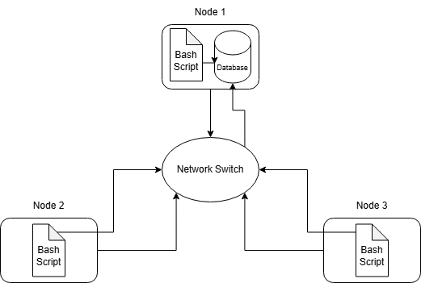

# Introduction

The Jarvis Linux Cluster Administration (LCA) team uses a Linux cluster of 10 servers running Rocky Linux that communicate through an internal switch using IPv4 addresses.
The purpose of this project is to collect and store hardware specifications and real-time resource usage data from each host in the cluster.

All collected data is stored in a PostgreSQL relational database and can be used to generate reports for capacity planning, performance analysis, and infrastructure optimization.
Users can write SQL queries to answer meaningful business questions based on the monitoring data.

Technologies used in this project include:

* Bash scripting
* Linux command line tools
* PostgreSQL
* Docker

# Quick Start

### psql_docker.sh

Creates a psql instance

`./scripts/psql_docker.sh create postgres postgres`

Starts the psql container 

`./scripts/psql_docker.sh startCheck if instance is runningdocker ps`

### ddl.sql

Connect to PostgreSQL

`psql -h localhost -U postgres -W`

Create database

`postgres=# CREATE DATABASE host_agent;`

Connect to the database

`postgres=# \c host_agent;`

Execute ddl.sql script after exiting psql (can exit with \q)

`psql -h localhost -U postgres -d host_agent -f sql/ddl.sql`

### host_info.sh

Collects hardware specs data and inserts it into host_info

`./scripts/host_info.sh localhost 5432 host_agent postgres postgres`

Check the data after connecting to the created database

`postgres=# SELECT * FROM host_info;`

### host_usage.sh

Collects hardware usage data and inserts it into host_usage

`bash scripts/host_usage.sh localhost 5432 host_agent postgres postgres`

Check the data after connecting to the created database

`postgres=# SELECT * FROM host_usage;`

### Automation setup for host_usage.sh using crontab

Edit crontab jobs

`bash> crontab -e`

Add this to the crontab file

`* * * * * bash /home/rocky/dev/jarvis_data_eng_Li/scripts/host_usage.sh localhost 5432 host_agent postgres postgres > /tmp/host_usage.log`

# Implemenation

## Architecture

The system consists of multiple Linux hosts that collect hardware and usage data, which is then stored in a centralized PostgreSQL database running in a Docker container.



## Scripts

### psql_docker.sh

Manages the PostgreSQL Docker container

Creates a psql instance

`./scripts/psql_docker.sh create <db_username> <db_password>`

Starts an already created psql instance

`./scripts/psql_docker.sh start`

Stops an already created psql instance

`./scripts/psql_docker.sh stop`

### host_info.sh

Grabs data such as hostname, number of CPUs, architecture, model, frequency, L2 cache size, and the total memory.

Collects hardware specs data and inserts it into host_info

`./scripts/host_info.sh <psql_host> <psql_port> <db_name> <psql_user> <psql_password>`

### host_usage.sh

Grabs data such as the timestamp, the amount of free memory, CPU idle time, kernel usage, disk I/O, and disk available space.

Collects hardware usage data and inserts it into host_usage

`bash scripts/host_usage.sh <psql_host> <psql_port> <db_name> <psql_user> <psql_password>`

### Crontab

Automation setup for host_usage.sh and schedules it to run every minute.

Edit crontab jobs

`bash> crontab -e`

Add this to the crontab file

`* * * * * bash /home/rocky/dev/jarvis_data_eng_Li/scripts/host_usage.sh localhost 5432 host_agent postgres postgres > /tmp/host_usage.log`

### queries.sql

This file contains SQL queries that help to analyze:

* CPU and memory usage over time
* Disk availability
* Host resource management
* and more…
These insights help support a business in carefully planning out resources, troubleshooting performance issues, and optimizing its infrastructure.

# Database Modeling

### host_info
```
| Column Name      | Data Type | Description                                   |
| ---------------- | --------- | --------------------------------------------- |
| id               | SERIAL    | Unique identifier for each host (primary key) |
| hostname         | VARCHAR   | Fully qualified hostname (unique)             |
| cpu_number       | SMALLINT  | Number of CPU cores                           |
| cpu_architecture | VARCHAR   | CPU architecture (e.g., x86_64)               |
| cpu_model        | VARCHAR   | CPU model name                                |
| cpu_mhz          | FLOAT     | CPU frequency in MHz                          |
| l2_cache         | INTEGER   | L2 cache size in KB                           |
| timestamp        | TIMESTAMP | Time when the record was collected            |
| total_mem        | INTEGER   | Total memory in KB                            |
```
### host_usage
```
| Column Name    | Data Type | Description                             |
| -------------- | --------- | --------------------------------------- |
| timestamp      | TIMESTAMP | Time when the usage data was collected  |
| host_id        | INTEGER   | Foreign key referencing `host_info(id)` |
| memory_free    | INTEGER   | Free memory in MB                       |
| cpu_idle       | SMALLINT  | Percentage of CPU idle time             |
| cpu_kernel     | SMALLINT  | Percentage of CPU kernel usage          |
| disk_io        | INTEGER   | Number of disk I/O operations           |
| disk_available | INTEGER   | Available disk space in MB              |
```
# Test

Each separate script was tested to ensure functionality and data integrity.

* PostgreSQL and DDL were tested by connecting to PostgreSQL, creating a host agent, and executing ddl.sql.
* Validated row data inserted in host_info and host_usage using SELECT * FROM host_info and SELECT * FROM host_usage.
* Crontab updates host_usage and executes automatically every minute without error.

# Deployment

The application was deployed using GitHub for version control, Docker for the PostgreSQL container, and crontab to automate the script.

* Project code pushed to the remote GitHub repository for version tracking.
* PostgreSQL was deployed in a Docker container using psql_docker.sh.
* Data initialized by executing ddl.sql against the PostgreSQL container
* Monitoring agents are deployed on each separate Linux host.

# Improvements

* Add alerts to monitoring and alerting (ie. If CPU usage passes a certain threshold)
* Standardize all units across the data pool (Mb/Kb)
* Change code to update dynamically with hardware changes

