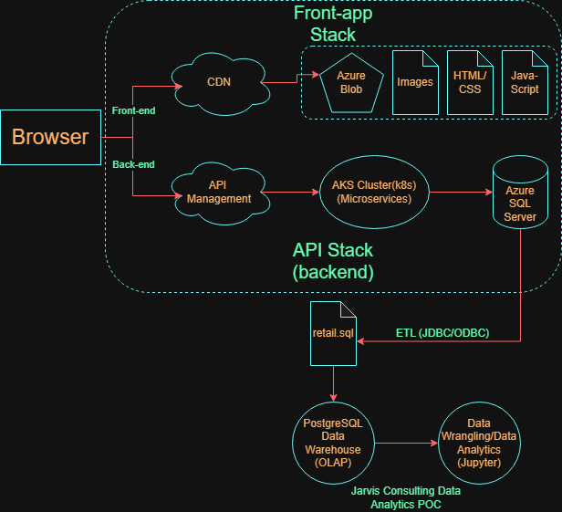

# Introduction
London Gift Shop (LGS) is a long-established UK-based e-commerce retailer specializing in giftware, with a large share of its customer base comprising wholesalers. 
Despite operating online for over a decade, recent revenue growth has stagnated, prompting the marketing team to seek data-driven strategies to understand customers better 
purchasing behaviour and improve campaign effectiveness.

This project delivers a proof-of-concept analytics solution to support the LGS marketing team. By analyzing historical transaction data, the project aims to look at
insights for customer behaviour, purchasing patterns, cancellations, and geographic trends. These insights can be used to design targeted marketing campaigns such as 
personalized email promotions, event-based offers, and customer segmentation strategies to improve customer retention and acquisition.

The following project uses Python-based data analytics tools in the Jupyter Notebook environment. The following are the packages used in this project:

- pandas
- matplotlib
- numpy
- sqlalchemy
- datetime

# Implementation
## Project Architecture
The LGS online store generates transactional data through its web application, which is stored in a relational database. For this proof-of-concept, the LGS IT team exported 
anonymous historical transaction data into a SQL file and shared it with the Jarvis consulting team.

## Data Analytics and Wrangling

[Retail Data Analytics Wrangling Notebook](./retail_data_analytics_wrangling.ipynb)

Our marketing strategy looks at 3 segments: "At Risk", "Needs Attention" and "Potential Loyalists".

Number of customers for each segment:

At Risk = 752, Needs Attention = 272, Potential Loyalists = 742

|| Mean Recency |Mean Frequency | Mean Monetary | 
|:-----------|:-----------:|:------------:|:------------:|
| At Risk       | 5552 days       | 4 purchases         | $1157.45        |
| Needs Attention  | 5290 days       | 3 purchases         | $1100.24        |
| Potential Loyalists      | 5184 days      | 23 purchases         | $10490.33        |

- At Risk Segment;

    - This segment holds a large customer base of 752 customers and has had a decent past frequency and spend. Customers in this segment have not recently made a purchase
      which puts them at risk of not spending any more money. Campaigns with personalized messages like "We miss you!" followed by a discount for their next order, coupled with
      advertising products similar to ones they have purchased in the past, would greatly increase revenue.

- Needs Attention;

    - This segment holds a medium-sized customer base of 272 customers and has a moderate frequency and spend. Customers in this segment are declining in engagement, so it is important to act fast. Campaigns that focus on engagement, like recommending products based on their purchase history or giving bundled discounts, would help this group that
      only needs a nudge.

- Potential Loyalists Segment;

    - This segment holds a large customer base of 742 customers and has a fairly recent frequency and moderate spending. Customers have strong potential to become loyal, which is the backbone of the company's future. Campaigns like loyalty perks, rewards for purchases, and personalized follow-ups after each purchase would increase the likelihood that they become loyal customers.

# Improvements

- Creating a new customer segment called "Churn," which would be a step higher than "At Risk," so you can offer higher discounts and bonuses to these customers.
- Analyze customer purchasing behaviour based on seasons and/or holidays for better marketing and campaign ads.
- Apply a K-means clustering on the customer segmentation, which would help with accuracy and find hidden behaviour groups.

