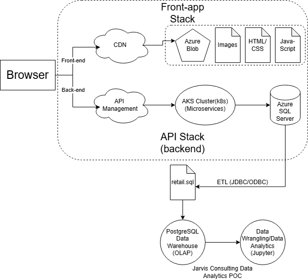

# Introduction
London Gift Shop (LGS) is a long-established UK-based e-commerce retailer specializing in giftware, with a large share of its customer base comprising wholesalers. 
Despite operating online for over a decade, recent revenue growth has stagnated, prompting the marketing team to seek data-driven strategies to understand customers better 
purchasing behaviour and improve campaign effectiveness.

This project delivers a proof-of-concept analytics solution to support the LGS marketing team. By analyzing historical transaction data, the project aims to look at
insights for customer behaviour, purchasing patterns, cancellations, and geographic trends. These insights can be used to design targeted marketing campaigns such as 
personalized email promotions, event-based offers, and customer segmentation strategies to improve customer retention and acquisition.

The following project uses Python-based data analytics tools in the Jupyter Notebook environment. The following are the packages used in this project:

- pandas
- matplotlib
- numpy
- sqlalchemy
- datetime

# Implementation
## Project Architecture
The LGS online store generates transactional data through its web application, which is stored in a relational database. For this proof-of-concept, the LGS IT team exported 
anonymous historical transaction data into a SQL file and shared it with the Jarvis consulting team.

- Describe the architecture of this project, including the LGS web app.
- Draw an architecture Diagram (please do not copy-paste any diagram from the project board)

## Data Analytics and Wrangling
- Create a link that points to your Jupyter notebook (use the relative path `./retail_data_analytics_wrangling.ipynb`)
- Discuss how would you use the data to help LGS to increase their revenue (e.g. design a new marketing strategy with data you provided)

# Improvements
- List three improvements that you want to do if you got more time

