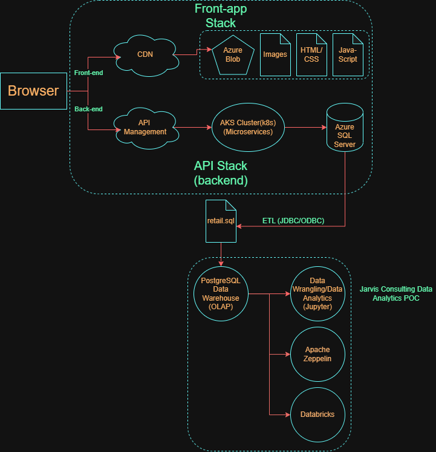

# Spark/Scala Project
# Introduction
London Gift Shop (LGS) is a long-established UK-based e-commerce retailer specializing in giftware, with a large share of its customer base comprising wholesalers. 
Despite operating online for over a decade, recent revenue growth has stagnated, prompting the marketing team to seek data-driven strategies to understand customers better 
purchasing behaviour and improve campaign effectiveness.

This project delivers a proof-of-concept analytics solution to support the LGS marketing team. By analyzing historical transaction data, the project aims to look at
insights for customer behaviour, purchasing patterns, cancellations, and geographic trends. These insights can be used to design targeted marketing campaigns such as 
personalized email promotions, event-based offers, and customer segmentation strategies to improve customer retention and acquisition.

Since the previous Python-based data analytics was so successful, LGS has decided to invest more money into this data engineering project and implement this data strategy across the company. Since the existing Jupyter notebook and Python cannot handle the large dataset, the team has decided to remake the data solution through Apache Spark that allows for processing across a cluster. The project will be run on two separate Spark environments, Zeppelin on Hadoop and Databricks on Microsoft Azure.

The following project implements a combination of Spark with SQL and Python in Zeppelin and Databricks. 

The following are the packages used in this project:

- pandas
- matplotlib
- numpy
- sqlalchemy
- datetime
- pyspark.sql

# Databricks/Zeppelin and Hadoop Implementation
The LGS online store generates transactional data through its web application, which is stored in a relational database. For this proof-of-concept, the LGS IT team exported anonymous historical transaction data into a SQL and json file and shared it with the Jarvis consulting team. This data is stored in the Hive Metastore in Databricks and ran through PySpark on the cluster and also stored in HDFS in Zeppelin and ran through PySpark on the clusters on GCP.

[View Notebook](./notebook/Retail%20Data%20Analytics%20with%20PySpark.ipynb)

[View JSON Data](./notebook/Spark%20Dataframe%20-%20WDI%20Data%20Analytics.json)

# Future Improvement
- List at least three future improvements for this project
